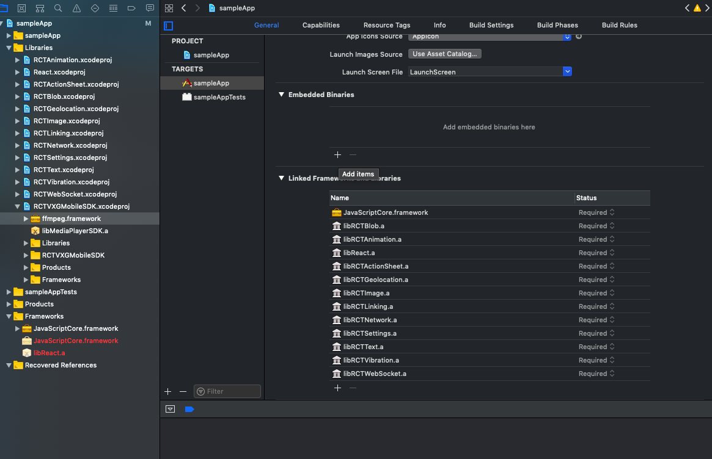
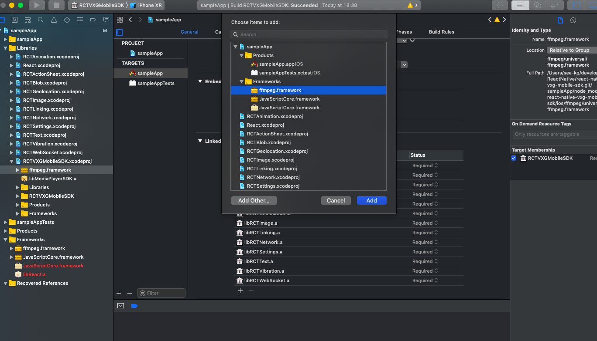

## react-native-vxg-mobile-sdk

Please visit www.videoexpertsgroup.com for any additional questions and support. 

A `<VXGMobileSDK>` component for react-native

*Notice: If you download version from github please look file BINARIES.md*

## Installation

Using npm:

```shell
npm install --save react-native-vxg-mobile-sdk
```

or using yarn:

```shell
yarn add react-native-vxg-mobile-sdk
```

<details>
  <summary>iOS</summary>

Run `react-native link react-native-vxg-mobile-sdk` to link the library.

Open your project in Xcode and create a link of ffmpeg.framework to Frameworks of main project:


After that, select the target of your application and select 'General' tab.
Scroll to 'Embedded Binaries' and tap the '+' button:



Select "ffmpeg.framework" from the list:



After that, select 'Build Settings' tab.
Find the option 'Framework Search Path' and double tap on it.
Tap the '+' button in the dialog and enter path to framework:

For Device Simulator:

`$(PROJECT_DIR)/../node_modules/react-native-vxg-mobile-sdk/ios/ffmpeg/universal/`

Or for appstore:

`$(PROJECT_DIR)/../node_modules/react-native-vxg-mobile-sdk/ios/ffmpeg/applestore/`


</details>

<details>
  <summary>Android</summary>
    TODO
</details>

<details>
  <summary>Windows</summary>
    You can request by email.
</details>

## Usage

```javascript
// Within your render function, assuming you have a file called
import React, { Component } from 'react';
import { StyleSheet, Button, Text, View } from 'react-native';
import { VXGMobileSDK } from 'react-native-vxg-mobile-sdk';

export default class SimplePlayerScreen extends Component {
    _url = null;
    constructor() {
      super();
      this._url = 'rtsp://184.72.239.149/vod/mp4:BigBuckBunny_115k.mov';
    }

    render() {
        return (
            <View style={styles.container}>
                <Text>Example 1: Simple Player</Text>
                <VXGMobileSDK 
                    style={styles.player}
                    config={{"connectionUrl": this._url, "autoplay": true}}></VXGMobileSDK>
            </View>
        );
    }
}

const styles = StyleSheet.create({
    container: {
        padding: 30,
        marginTop: 65,
        alignItems: "stretch"
    },
    player: {
        paddingTop: 20,
        borderWidth: 1,
        borderColor: 'black',
        width: '100%',
        height: 250,
    },
});
```

## Change Config in Runtime

* *connectionUrl* - Network protocol or RTP/RTSP tunneling (0 – RTP by UDP, 1 – RTP by TCP, 2 – RTSP over http, 3 – RTSP over https, -1 - AUTO)
* *decodingType* 1 - use hardware decoder or 0 - sofware decoder |
* *connectionNetworkProtocol* - Network protocol or RTP/RTSP tunneling (0 – RTP by UDP, 1 – RTP by TCP, 2 – RTSP over http, 3 – RTSP over https, -1 - AUTO)
* *numberOfCPUCores* - Number of CPU cores to decode video, ≤ 0 – autodetect and set the number according device capability, positive number sets number according application needs |
* *synchroEnable* - Enable A/V synchronization, 1 - synchronization is on, 0 - is off
* *connectionBufferingTime* - Buffering on playback start to avoid network jitter (in milliseconds)
* *connectionDetectionTime* - Probing time to detect video and audio formats of network stream (in milliseconds)
* *startPreroll* - Start player in Paused mode (in milliseconds)
* *aspectRatioMode* - 0 - stretch, 1 - fit to screen with aspect ratio, 2 - crop, 3 - 100% size, 4 - zoom mode, 5 - move mode)


```javascript
import React, { Component } from 'react';
import { Platform, StyleSheet, Text, View } from 'react-native';
import { VXGMobileSDK } from 'react-native-vxg-mobile-sdk';
import {Actions, ActionConst} from 'react-native-router-flux';

export default class MoreOptionsPlayerScreen extends Component {
    _player = null;
    constructor() {
        super();
        this._play1 = this._play1.bind(this);
    }

    async _play1() {
        // TODO reopen player
        // console.log(this._player);
        await this._player.close();
        await this._player.applyConfig({
            "connectionUrl": "rtsp://184.72.239.149/vod/mp4:BigBuckBunny_115k.mov",
            "decodingType": 0, // Hardware – 1, Sofware – 0
            "connectionNetworkProtocol": -1, // 0 - udp, 1 - tcp, 2 - http, 3 - https, -1 - AUTO
            "numberOfCPUCores": 0, // 0<= - autodetect, > 0 - will set manually
            "synchroEnable": 1, // Enable A/V synchronization, 1 - synchronization is on, 0 - is off
            "connectionBufferingTime": 1000,
            "connectionDetectionTime":  1000,
            "startPreroll": 300,
            "aspectRatioMode": 1 // 0 - stretch, 1 - fit to screen with aspect ratio, 2 - crop, 3 - 100% size, 4 - zoom mode, 5 - move mode)
        });
        await this._player.open();
    }

    _assignPlayer = (plr) => {
        this._player = plr;
    }

    render() {
        return (
            <View style={styles.container}>
                <VXGMobileSDK 
                    ref={this._assignPlayer}
                    style={styles.player}
                    ></VXGMobileSDK>

                <Button
                    onPress={this._play1} 
                    title="Play 1"
                    color="#841584"
                />
            </View>
        );
    }
}

const styles = StyleSheet.create({
    container: {
        padding: 30,
        marginTop: 65,
        alignItems: "stretch"
    },
    player: {
        paddingTop: 20,
        borderWidth: 1,
        borderColor: 'black',
        width: '100%',
        height: 250,
    },
});
```
