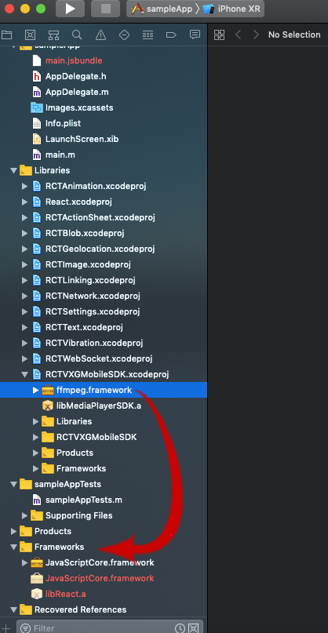
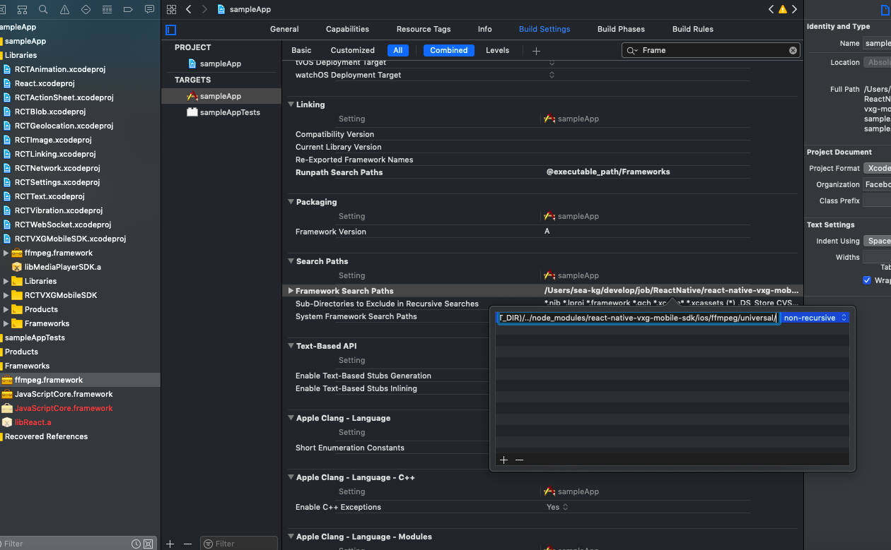

## react-native-vxg-mobile-sdk

A `<RCTVXGMobileSDK>` component for react-native


## Installation

Using npm:

```shell
npm install --save react-native-vxg-mobile-sdk
```

or using yarn:

```shell
yarn add react-native-vxg-mobile-sdk
```

<details>
  <summary>iOS</summary>

Run `react-native link react-native-vxg-mobile-sdk` to link the library.

Open your project in Xcode, and create link of ffmpeg.framework to Frameworks of main project:



After that, select the target of your application and select 'General' tab.
Scroll to 'Embeded libraries' and tap on the + button:


Tab on + and select "ffmpeg.framework" from a list:


After that, select 'Build Settings' tab.
Find option 'Framework Search Path' double tap on this
Tap again on the + button in dialog and enter path to framework:

For support emulator

`$(PROJECT_DIR)/../node_modules/react-native-vxg-mobile-sdk/ios/ffmpeg/universal/`

For appstore:

`$(PROJECT_DIR)/../node_modules/react-native-vxg-mobile-sdk/ios/ffmpeg/appstore/`



</details>

<details>
  <summary>Android</summary>
    TODO
</details>

<details>
  <summary>Windows</summary>
    You can request by email.
</details>

## Usage

```javascript
// Within your render function, assuming you have a file called
import React, { Component } from 'react';
import { StyleSheet, Button, Text, View } from 'react-native';
import { RCTVXGMobileSDK } from 'react-native-vxg-mobile-sdk';
import { Actions } from 'react-native-router-flux';

export default class SimplePlayerScreen extends Component {
    _url = null;
    constructor() {
      super();
      this._url = 'rtsp://184.72.239.149/vod/mp4:BigBuckBunny_115k.mov';
      this._onBack = this._onBack.bind(this);
    }
    
    _onBack = () => {
        Actions.pop();
    }

    render() {
        return (
            <View style={styles.container}>
                <Button
                    onPress={this._onBack} 
                    title="Back"
                    color="#841584"
                />
                <Text>Example 1: Simple Player</Text>
                <RCTVXGMobileSDK 
                    style={styles.player}
                    url={this._url}></RCTVXGMobileSDK>
            </View>
        );
    }
}

const styles = StyleSheet.create({
    container: {
        padding: 30,
        marginTop: 65,
        alignItems: "stretch"
    },
    player: {
        paddingTop: 20,
        borderWidth: 1,
        borderColor: 'black',
        width: '100%',
        height: 250,
    },
});
```